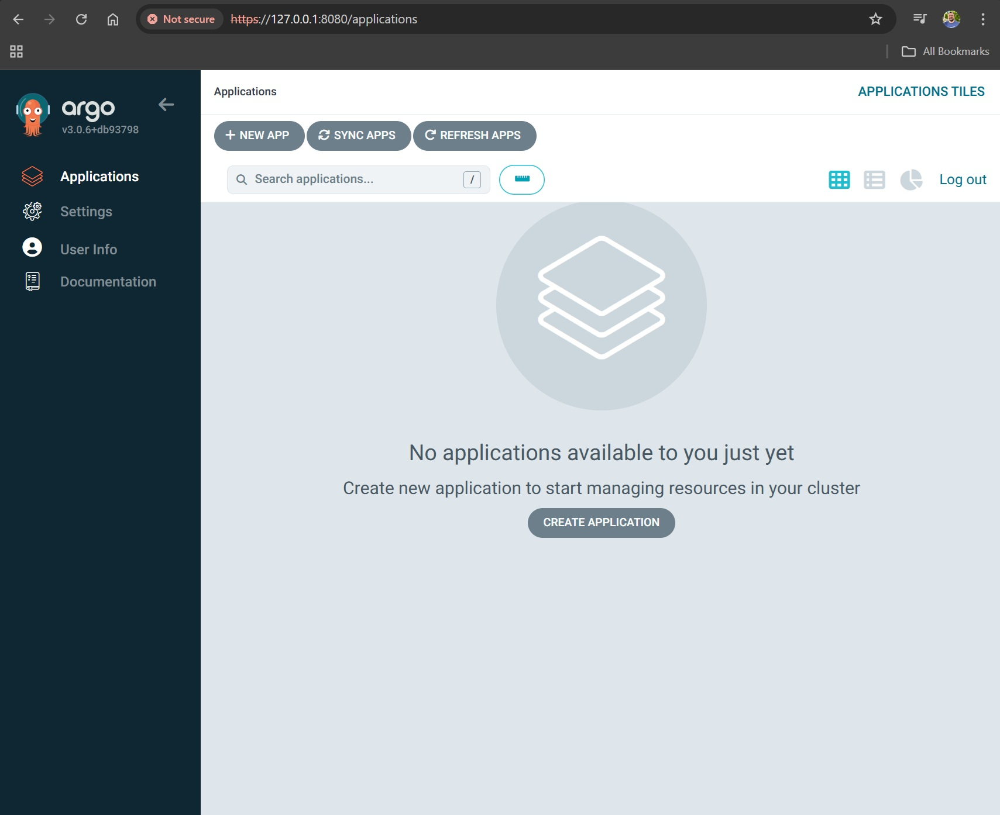
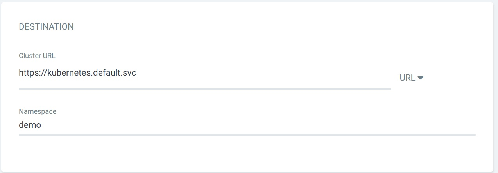

## Proof of Concept. ArgoCD


We will explore a toolset for deploying applications of any complexity. We start with a prepared [repository](https://github.com/vit-um) and write a bit of code to automate the full `CI` вprocess from build to artifact. Then we evaluate additional tools for the `CD` stage.

We organize Delivery using the `pull` model,  pulling changes from the repository. We adopt a "one application - one cluster" approach, meaning each app gets its own isolated cluster. To achieve this, we use a single-host Kubernetes cluster. For Delivery and Deployment in a test environment, we select

Delivery ми організуємо за моделлю `pull` або втягування змін з репозиторію. Виберемо підхід "one application - one cluster", тоб-то для кожного додатку буде взятий один окремий кластер. З цією метою використаємо "single host kubernetes cluster" А в якості системи Delivery та Deploy на тестове оточення виберемо [ArgoCD](https://argo-cd.readthedocs.io/en/stable/).  

`ArgoCD` is a Kubernetes controller that continuously monitors running applications and compares their current state to the desired state. If the live state differs, the deployment is marked as out of sync. ArgoCD informs the user and visualizes the differences, allowing automatic or manual synchronization. 

### 1. Prepare a Local Cluster for ArgoCD  
```bash
$ k3d cluster create argo
INFO[0000] Prep: Network                                
INFO[0000] Created network 'k3d-argo'                   
INFO[0000] Created image volume k3d-argo-images         
INFO[0000] Starting new tools node...                   
INFO[0000] Starting node 'k3d-argo-tools'               
INFO[0001] Creating node 'k3d-argo-server-0'            
INFO[0001] Creating LoadBalancer 'k3d-argo-serverlb' 

$ kubectl cluster-info
Kubernetes control plane is running at https://0.0.0.0:41573
CoreDNS is running at https://0.0.0.0:41573/api/v1/namespaces/kube-system/services/kube-dns:dns/proxy
Metrics-server is running at https://0.0.0.0:41573/api/v1/namespaces/kube-system/services/https:metrics-server:https/proxy

$ kubectl get all -A
NAMESPACE     NAME                                          READY   STATUS      RESTARTS   AGE
kube-system   pod/coredns-ccb96694c-2fdgp                   1/1     Running     0          39s
kube-system   pod/helm-install-traefik-bhwgg                0/1     Completed   1          40s
kube-system   pod/helm-install-traefik-crd-kn4ld            0/1     Completed   0          40s
kube-system   pod/local-path-provisioner-5cf85fd84d-mczc8   1/1     Running     0          39s
kube-system   pod/metrics-server-5985cbc9d7-gftw6           1/1     Running     0          39s
kube-system   pod/svclb-traefik-2ad711f8-wvp27              2/2     Running     0          33s
kube-system   pod/traefik-5d45fc8cc9-jhqmw                  1/1     Running     0          33s


```
### 2. Installation 
For ArgoCD insatllation we will use the official install manifest [ArgoCD](https://argo-cd.readthedocs.io/en/stable/#quick-start) :     
```bash
$ kubectl create namespace argocd
namespace/argocd created
$ kubectl get ns
NAME              STATUS   AGE
argocd            Active   10s
default           Active   2m45s
kube-node-lease   Active   2m45s
kube-public       Active   2m45s
kube-system       Active   2m45s
$ kubectl apply -n argocd -f https://raw.githubusercontent.com/argoproj/argo-cd/stable/manifests/install.yaml
customresourcedefinition.apiextensions.k8s.io/applications.argoproj.io created
customresourcedefinition.apiextensions.k8s.io/applicationsets.argoproj.io created
customresourcedefinition.apiextensions.k8s.io/appprojects.argoproj.io created
serviceaccount/argocd-application-controller created
serviceaccount/argocd-applicationset-controller created
serviceaccount/argocd-dex-server created
serviceaccount/argocd-notifications-controller created
serviceaccount/argocd-redis created
serviceaccount/argocd-repo-server created
serviceaccount/argocd-server created
role.rbac.authorization.k8s.io/argocd-application-controller created
role.rbac.authorization.k8s.io/argocd-applicationset-controller created
role.rbac.authorization.k8s.io/argocd-dex-server created
role.rbac.authorization.k8s.io/argocd-notifications-controller created
role.rbac.authorization.k8s.io/argocd-redis created

$ kubectl get all -n argocd
NAME                                                   READY   STATUS    RESTARTS   AGE
pod/argocd-application-controller-0                    1/1     Running   0          36s
pod/argocd-applicationset-controller-67c79fccd-2dwf7   1/1     Running   0          37s
pod/argocd-dex-server-76686f75bd-wq2mr                 1/1     Running   0          36s
pod/argocd-notifications-controller-588d87b767-6dk4l   1/1     Running   0          36s
pod/argocd-redis-59c6f8b4b5-2ltrg                      1/1     Running   0          36s
pod/argocd-repo-server-57db679bf7-bpmk5                1/1     Running   0          36s
pod/argocd-server-67b6bf4f8d-crqbq                     1/1     Running   0          36s

$ kubectl get po -n argocd -w
NAME                                               READY   STATUS    RESTARTS   AGE
argocd-application-controller-0                    1/1     Running   0          89s
argocd-applicationset-controller-67c79fccd-2dwf7   1/1     Running   0          90s
argocd-dex-server-76686f75bd-wq2mr                 1/1     Running   0          89s
argocd-notifications-controller-588d87b767-6dk4l   1/1     Running   0          89s
argocd-redis-59c6f8b4b5-2ltrg                      1/1     Running   0          89s
argocd-repo-server-57db679bf7-bpmk5                1/1     Running   0          89s
argocd-server-67b6bf4f8d-crqbq                     1/1     Running   0          89s

```
All ArgoCD components should be in `Running` state.

### 3. Access the ArgoCD GUI 
We can [get access](https://argo-cd.readthedocs.io/en/stable/getting_started/#3-access-the-argo-cd-api-server) by using `Port Forwarding` with a local port 8080.  
```bash
$ kubectl port-forward svc/argocd-server -n argocd 8080:443&
[1] 118483
$ Forwarding from 127.0.0.1:8080 -> 8080
Forwarding from [::1]:8080 -> 8080
Handling connection for 8080
```
Access to ArgoCD is through browser:  [127.0.0.1:8080](https://127.0.0.1:8080/) You'll get a certificate warning since ArgoCD uses HTTPS with a self-signed certificate. 

### 4. Get Admin Password 
   
```bash
$ kubectl -n argocd get secret argocd-initial-admin-secret -o jsonpath="{.data.password}" | base64 -d; echo
txV2pWUXRw9ntFCc
```
Use username admin and the decoded password to log in to the ArgoCD web UI.
 
### 5. Create an Application via GUI 
 
Applications configured in ArgoCD will now be auto-deployed and updated in Kubernetes. 
- Click `+ NEW APP` 
- Type in the name `demo`
- Choose `default` project
- Sync Policy `Manual`
- Sync Options: `Auto-create namespace`
  
- In `SOURCE` section we choose `GIT`
- Repo URL: `https://github.com/den-vasyliev/go-demo-app`
- `Path`: `helm`  
  
- `DESTINATION` section select local cluster `url` and `Namespace` demo. ArgoCD will automatically detect the application parameters using the manifests located in the repository. If you wish to override values manually, you can do so in the `PARAMETERS` section.  

- Click `CREATE`  
  

### 6. View App Details.  
Click on the deployed app in ArgoCD. You will see a hierarchical view of its components, deployments, and real-time status. 

  

### 7. App syncronization 
- Click `SYNC` in the application view
- Select components and sync strategy and click `SYNCHRONIZE`  
- Check deployment status  

  
  
  
